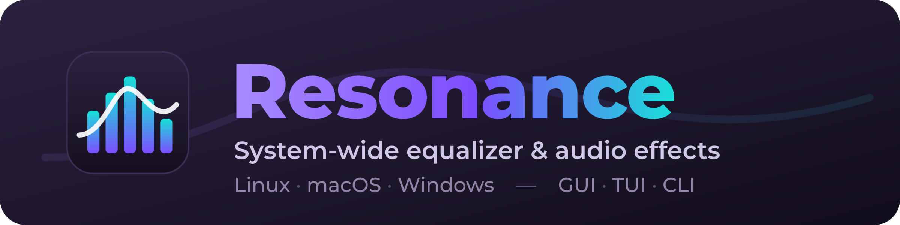
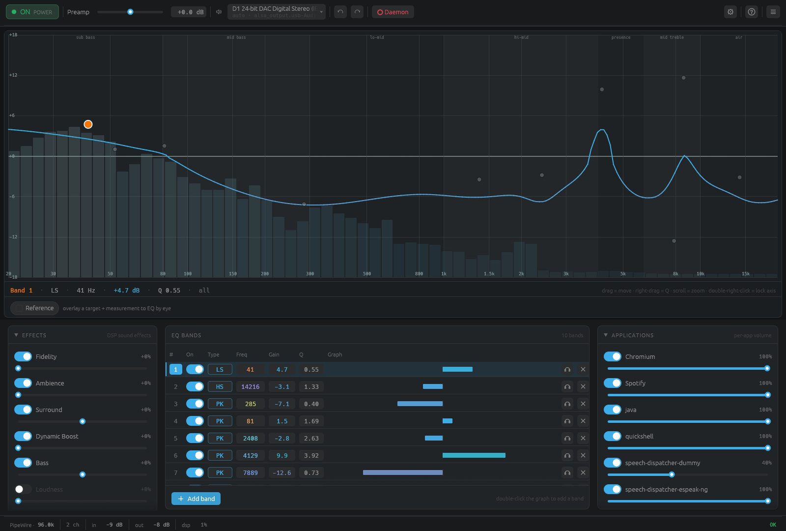
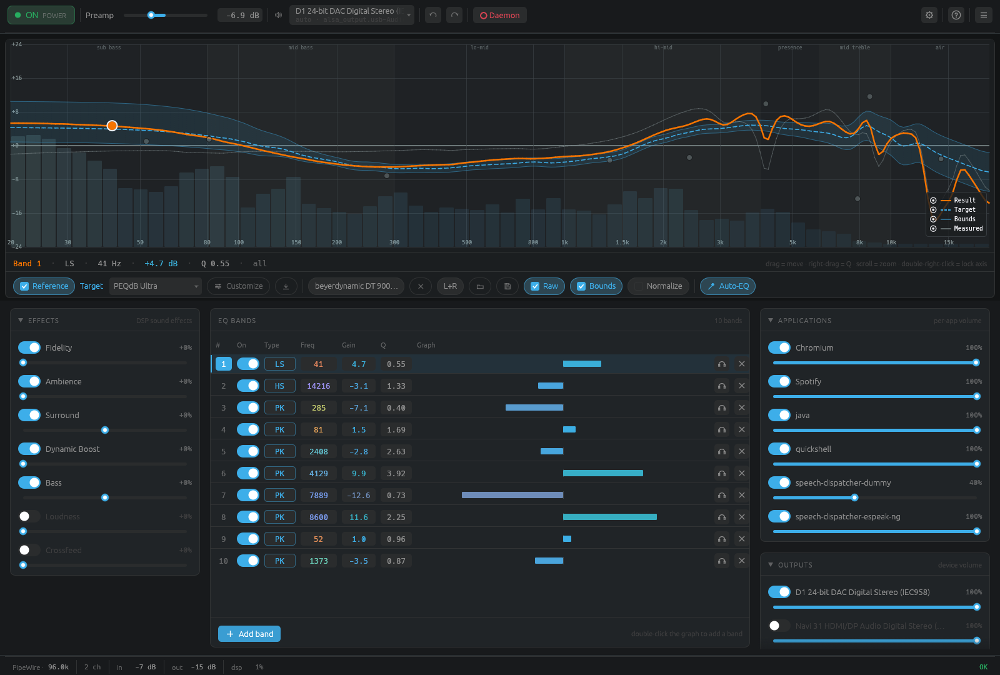
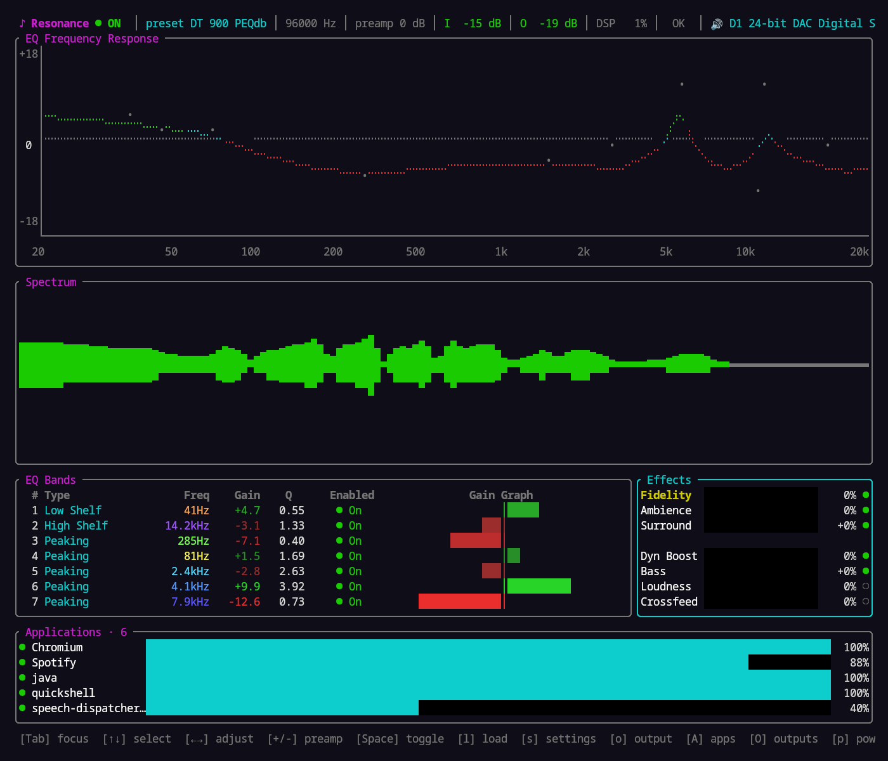
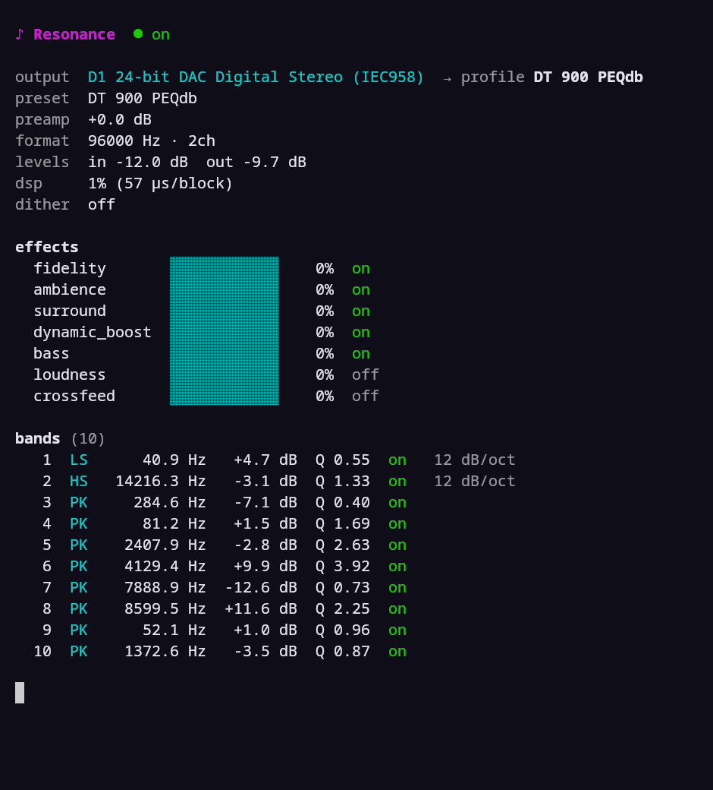
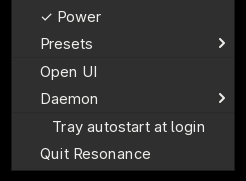
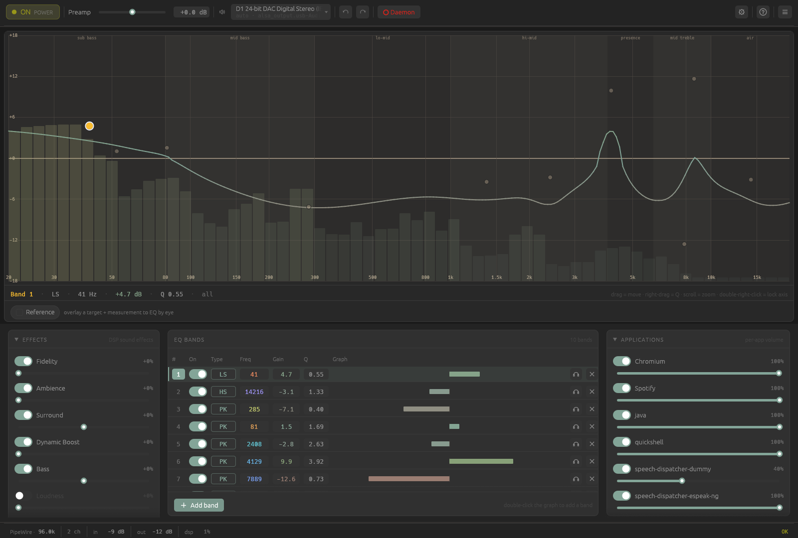
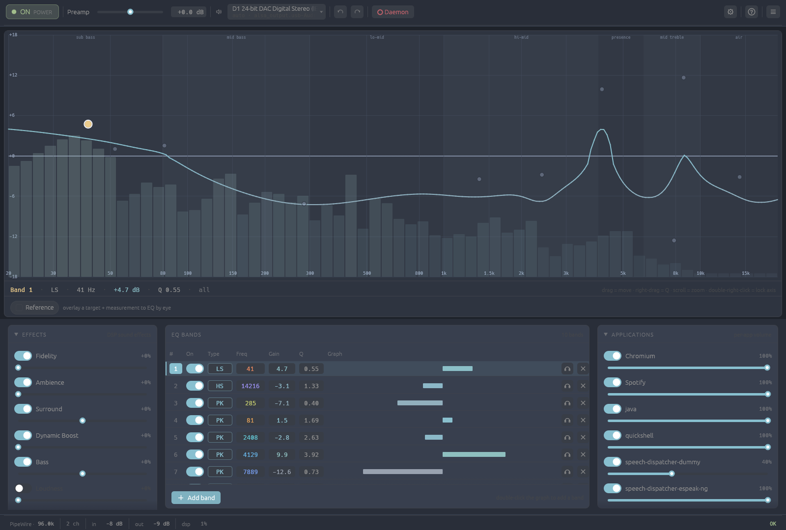
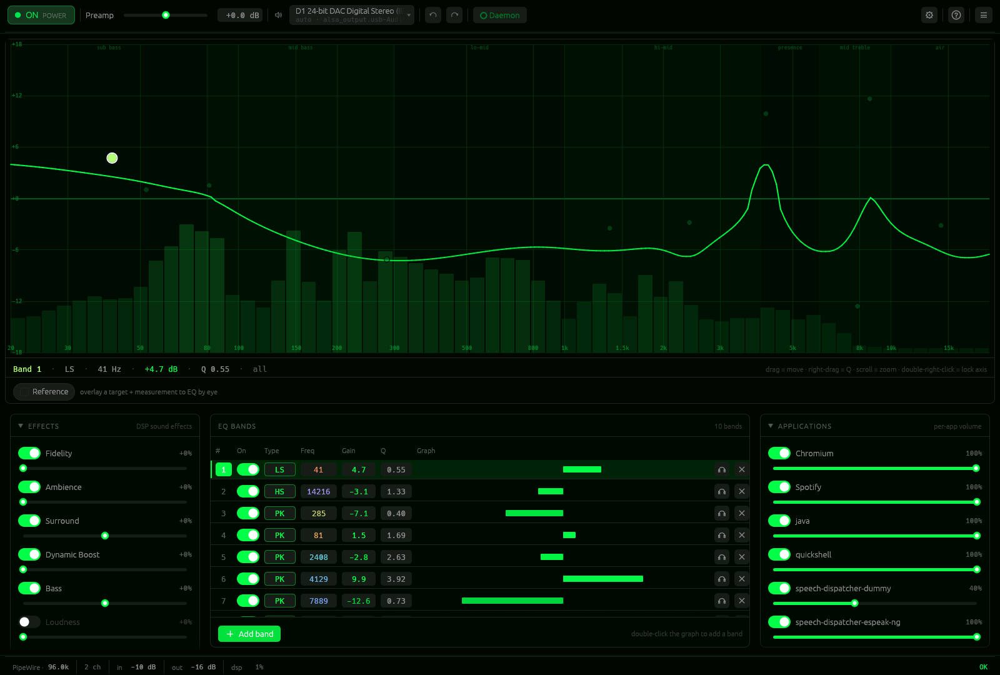
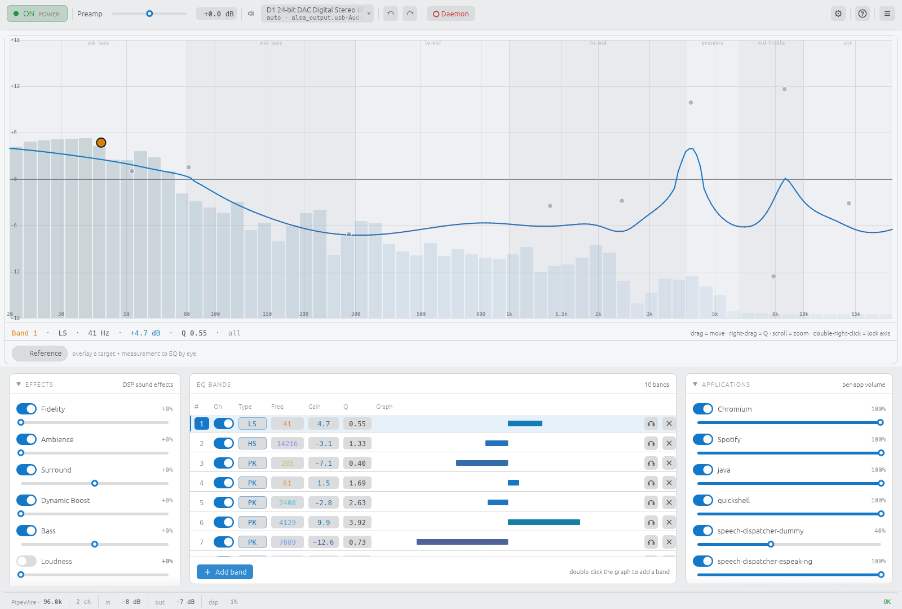

<div align="center">



<br>

[](https://github.com/ealtun21/resonance/actions/workflows/ci.yml)
[](https://github.com/ealtun21/resonance/releases)
[](LICENSE)


<br>

[](https://github.com/ealtun21/resonance/wiki/Installation)
[](https://github.com/ealtun21/resonance/wiki)
[](https://github.com/ealtun21/resonance/wiki/Usage)
[](docs/ROADMAP.md)
[](https://github.com/ealtun21/resonance/releases)

<br>



</div>

## What is Resonance?

**Resonance is a system-wide equalizer and audio-effects engine for Linux, macOS,
and Windows.** It captures your system audio, runs it through a high-precision
(`f64`) DSP chain — a full parametric EQ plus a suite of FxSound-style effects —
and plays the processed result back on your output device. One daemon, three
front-ends: a **desktop GUI**, a **terminal UI**, and a scriptable **CLI**.

It loads **FxSound `.fac`** presets and **EqualizerAPO `.txt`** configs, downloads
**AutoEq / squig.link** correction profiles, and overlays a live
**reference-target measurement** so you can EQ by eye. No virtual cables, no
kernel drivers — each platform hooks system audio the native way (PipeWire on
Linux, a Core Audio process tap on macOS, an in-graph APO on Windows).

## Features

- **Parametric EQ** — unlimited bands, 14 biquad filter types (Audio EQ Cookbook),
  per-band slope (12/24/48 dB/oct), and per-band scope (Stereo / Mid / Side).
- **FxSound-matched effects** — Fidelity, Ambience, Surround, Dynamic Boost, Bass,
  tuned to sound like FxSound so imported presets translate faithfully.
- **Advanced DSP** — dynamic EQ, optional linear-phase EQ, headphone crossfeed,
  ISO 226:2023 loudness compensation, convolution / impulse-response loader, and
  output dithering.
- **Reference & Auto-EQ** — overlay a target curve + a headphone/IEM measurement,
  shade the listener-preference bounds, and one-click Auto-EQ toward the target;
  browse measurements straight from squig.link.
- **Preset interop** — FxSound `.fac`, EqualizerAPO `.txt`, REW imports, AutoEq
  downloads, and `.toml` preset metadata.
- **Per-app & per-output control** — independent volume/mute per application and
  per output sink, two-way synced with the system mixer.
- **N-channel + routing** — per-channel EQ and an N×N routing matrix, not just
  stereo.
- **Three clients** — desktop **GUI** (`resonance-gui`), terminal **TUI**
  (`resonance-tui`), and **CLI** (`resonance`), plus an optional system **tray**.
- **Cross-platform, one codebase** — Linux/PipeWire, macOS/Core Audio, and
  Windows/APO, all driven by the same commands.
- **Lock-free real-time path** — tokio IPC thread → `rtrb` SPSC ring → audio
  thread, no allocations on the hot path.

## Screenshots

### Reference target + Auto-EQ

Overlay a target curve and a real measurement, keep the result inside the
listener-preference bounds, or let Auto-EQ fit the bands for you.

<div align="center">

</div>

### Terminal UI &nbsp;·&nbsp; CLI

<table>
<tr>
<td width="62%"></td>
<td width="38%"></td>
</tr>
</table>

### System tray

An optional standalone tray controller (`resonance-tray`) toggles power, swaps
presets, opens or quits a UI, and manages the daemon — without embedding any of
that in the daemon itself.

<div align="center">

</div>

### Themes

The GUI ships several built-in themes (plus a matugen/pywal auto theme).

<table>
<tr>
<td><br><div align="center"><sub>Gruvbox</sub></div></td>
<td><br><div align="center"><sub>Nord</sub></div></td>
</tr>
<tr>
<td><br><div align="center"><sub>Matrix</sub></div></td>
<td><br><div align="center"><sub>Light</sub></div></td>
</tr>
</table>

## Install

> Full, per-platform instructions live in the **[Installation wiki page](https://github.com/ealtun21/resonance/wiki/Installation)**.

### Linux — one-liner (any distro)

Downloads the latest release, verifies its checksum, and installs the binaries
(handles immutable distros like SteamOS/Silverblue by installing into `~/.local`):

```sh
curl -fsSL https://raw.githubusercontent.com/ealtun21/resonance/master/install.sh | bash
```

On an Arch checkout the same script builds a real pacman package via the shipped
`PKGBUILD` (`resonance-eq`).

### macOS

Requires macOS 14.2+ (Core Audio process-tap API — no BlackHole/kext needed):

```sh
git clone https://github.com/ealtun21/resonance && cd resonance
contrib/macos/build-app.sh && mv Resonance.app ~/Applications/
```

Then grant **Screen Recording** to `Resonance.app` and launch it via Launch
Services. See the [macOS guide](https://github.com/ealtun21/resonance/wiki/Installation#macos).

### Windows

Download `resonance-setup-x.y.z.exe` from the
[releases page](https://github.com/ealtun21/resonance/releases) and run it. It
attaches an in-graph **Audio Processing Object** to your playback device — no
virtual cable or kernel driver. See the
[Windows guide](https://github.com/ealtun21/resonance/wiki/Installation#windows).

### From source

```sh
sudo pacman -S pipewire pkgconf   # Arch/CachyOS deps
cargo build --release --all       # -> target/release/{resonanced,resonance,resonance-tui,resonance-gui}
```

## Usage

Start the daemon, then drive it from any client:

```sh
RUST_LOG=info resonanced          # start the daemon (autostart: resonance daemon enable)

resonance status                  # power, preset, effects, EQ, meters
resonance load preset.fac         # load a .fac / EqualizerAPO .txt
resonance set fidelity 70         # effect intensity 0-100
resonance autoeq "HD 600"         # download + apply an AutoEq correction
resonance preamp -3.5             # preamp gain in dB

resonance-tui                     # interactive terminal UI
resonance-gui                     # desktop UI
```

The full command reference (presets, profiles, output mappings, A/B, service
control, completions) is on the **[Usage wiki page](https://github.com/ealtun21/resonance/wiki/Usage)**.

## Status & roadmap

Resonance is in active development and used daily on Linux/PipeWire. The
cross-platform backends, all three clients, preset interop, reference/Auto-EQ,
per-app/per-output control, and the advanced DSP features above are shipped. See
the [roadmap](docs/ROADMAP.md) for what's next.

## Contributing

Issues and PRs welcome. Before committing:

```sh
make check    # rustfmt --check + clippy -D warnings + tests
```

Commits follow [Conventional Commits](https://www.conventionalcommits.org/).
More detail in the [Architecture wiki page](https://github.com/ealtun21/resonance/wiki/Architecture).

## License

[GPL-3.0-or-later](LICENSE).
